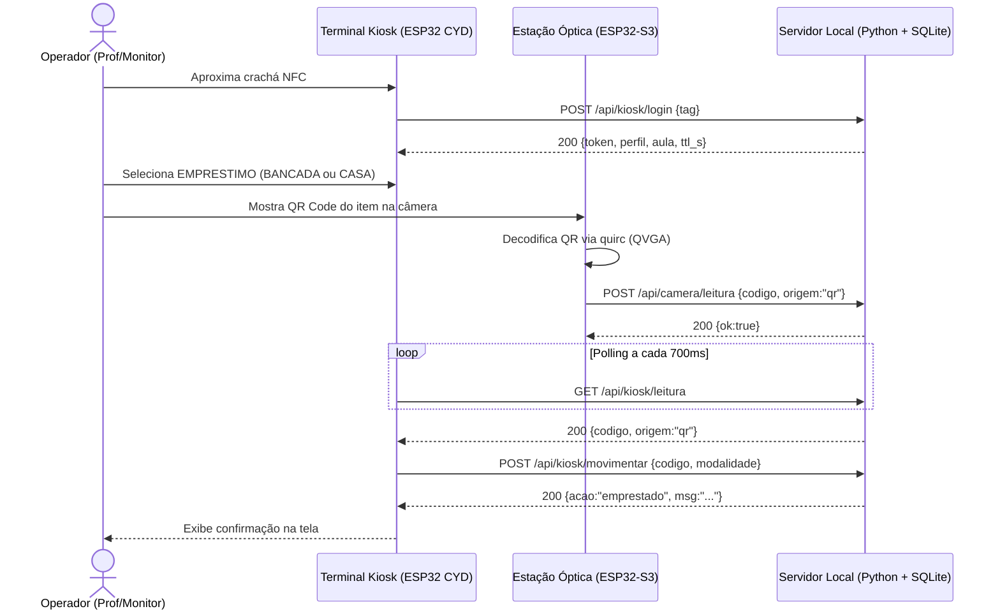
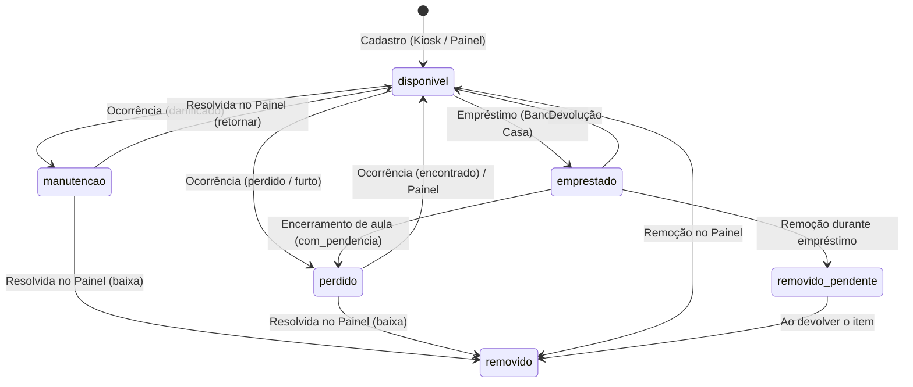

# Diagramas UML e Fluxos do MVP

## Fluxo de Empréstimo com Câmera ESP32-S3 + Kiosk CYD

```mermaid
sequenceDiagram
    actor Op as Operador (Prof/Monitor)
    participant CYD as Terminal Kiosk (ESP32 CYD)
    participant S3 as Estação Óptica (ESP32-S3)
    participant SRV as Servidor Local (Python + SQLite)

    Op->>CYD: Aproxima crachá NFC
    CYD->>SRV: POST /api/kiosk/login {tag}
    SRV-->>CYD: 200 {token, perfil, aula, ttl_s}

    Op->>CYD: Seleciona EMPRESTIMO (BANCADA ou CASA)
    Op->>S3: Mostra QR Code do item na câmera
    S3->>S3: Decodifica QR via quirc (QVGA)
    S3->>SRV: POST /api/camera/leitura {codigo, origem:"qr"}
    SRV-->>S3: 200 {ok:true}

    loop Polling a cada 700ms
        CYD->>SRV: GET /api/kiosk/leitura
    end
    SRV-->>CYD: 200 {codigo, origem:"qr"}

    CYD->>SRV: POST /api/kiosk/movimentar {codigo, modalidade}
    SRV-->>CYD: 200 {acao:"emprestado", msg:"..."}
    CYD-->>Op: Exibe confirmação na tela
```

## Ciclo de Estados de um Item Físico

```mermaid
stateDiagram-v2
    [*] --> disponivel: Cadastro (Kiosk / Painel)
    disponivel --> emprestado: Empréstimo (Bancada / Casa)
    emprestado --> disponivel: Devolução
    disponivel --> manutencao: Ocorrência (danificado)
    disponivel --> perdido: Ocorrência (perdido / furto)
    emprestado --> perdido: Encerramento de aula (com_pendencia)
    manutencao --> disponivel: Resolvida no Painel (retornar)
    manutencao --> removido: Resolvida no Painel (baixa)
    perdido --> disponivel: Ocorrência (encontrado) / Painel
    perdido --> removido: Resolvida no Painel (baixa)
    disponivel --> removido: Remoção no Painel
    emprestado --> removido_pendente: Remoção durante empréstimo
    removido_pendente --> removido: Ao devolver o item
```
